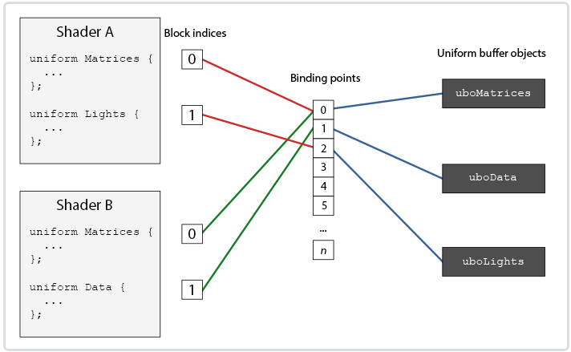
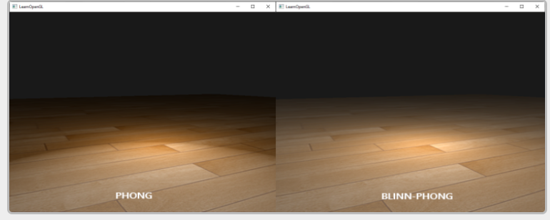

## 简介

* c++学习的地址：www.learncpp.com

## 入门

### 简介

* OpenGL仅仅只是一个规范，并不是一个API
* 渲染模式分为立即渲染模式和核心渲染模式，前者就是固定渲染管线，后者开放更多细节交给开发者使用
* OpenGL自身是一个巨大的状态机，一些列的变量描述OpenGL此时应该如何运行。这个状态通常被称为上下文，**OpenGL本身提供了一些状态设置函数以及状态使用函数，前者可以修改上下文，后者可以利用上下文进行一系列操作。**
* OpenGL中的对象大多采用结构体表示。
* 当我们需要对一个对象进行操作时，我们对需要使用的对象，使用一个id来保存它的引用。然后我们将对象绑定到上下文的目标位置，对对象结束操作之后，解绑这个对象，设置的内容还会存在于ObjectID所引用到的对象中。

#### 环境配置

为了可以再不同的电脑上开发，这边还是将windows下的环境配置文件上传了。

* 构建GLFW，[源码地址](http://www.glfw.org/download.html)，可以下载编译的库以及二进制文件
* 下载CMake，使用CMake GUI，选择源代码目录以及存放编译结果的目标文件目录，选择GLFW源码目录，然后新建一个build文件夹，选中作为目标目录。之后Configure点击一下，生成器选择是Visual Studio16的工具链。再次点击Configure，保存之后，点击Generate，生成的工程文件就会在你的build文件夹中。
* 打开build目录，打开sln工程，直接点击build solution，在build/src/Debug下就有glfw3.lib。
* 创建工程后选择x64平台，在属性的VC++的目录下添加include目录以及lib目录。
* 除此之外，在链接器部分的Input部分，在Additional Dependencies添加glfw3.lib，除此之外，还需要添加opengl32.lib。
* 配置[GLAD](https://glad.dav1d.de/), 选择语言为c/c++，选择3.3的opengl版本，profile设置core，选中Generate a loader，点击生成即可。GLAD会返回两个include文件夹和一个glad.c，需要将glad.c添加到你的工程中。

添加指令

```cpp
#inlcude <glad/glad.h>
```

### 创建窗口

* 刚开始初始化glfw

* 之后设置好glfw的版本号码（自己在这里用的是3.3）

* 然后设置opengl的渲染模式，core_profile

* 创建窗口，并且将当前window的context设置成本线程的context.

* 然后去gladLoadGLLoader加载函数的实际地址

* 之后就是调整视口，窗口调整回调以及renderLoop的逻辑

具体可以看代码中的内容。

### 绘制三角形

三个名词:

* Vertex Array Object, VAO

* Vertex Buffer Object, VBO

* Element Buffer Object, EBO或者称为Index Buffer Object, IBO

#### 可配置阶段

顶点着色器，集合着色器和片段着色器

#### 顶点输入

绘制图形之前，我们需要先给OpenGL输入一些顶点数据，openGL的NDC只处理在[-1.0 ， 1.0]之间的数据（一般来说，vertex shader会将之前的空间坐标系转换至NDC中），之后再做一次视口变换即可。

* 我们通过VBO来管理这个内存，他会在GPU显存中存储大量顶点，使用VBO的好处是我们可以一次性发送大批数据到显卡上，而不是每个顶点发送一次。

#### 创建着色器

* 使用glCreateShader(\<SHADER_TYPE\>)来创建shader

* 使用`glShadaerSource`来替换shader中的代码

* `glCompileShader`用于编译shader。

#### 链接着色器

* 说是链接，其实是单独的顶点着色器与片段着色器需要一个shaderprogram才可以使用。

下面的例子自行体会

```cpp
unsigned int shaderProgram;
shaderProgram = glCreateProgram();

glAttachShader(shaderProgram, vertexShader);
glAttachShader(shaderProgram, fragmentShader);
glLinkProgram(shaderProgram);
// 激活该程序对象
glUseProgram(ShaderProgram);
```

#### 链接顶点属性

需要指定OpenGL如何理解顶点数据。

* 使用`glVertexAttribPointer`指定顶点数组的一系列属性

* 完成之后，需要使用glEnableVertexAttribArray来指定

* The zeroing behavior does not match x86 (i.e. this instruction zeroes when an index is out-of-range instead of when the most significant bit is 1); use a constant swizzle amount (or i8x16.shuffle) to avoid 3 extra x86 instructions in some runtimes.

## 高级OpenGL篇

这边插一句，因为中间的笔记都写在纸质部分，因此这里直接从高级数据部分开始，但是中间缺失的笔记部分也会从纸质转到电子文档。

### 高级数据

* OpenGL中的数据无外乎是一个管理特定内的对象，将其绑定到一个Buffer Target上时才为其赋予了意义。例如，绑定缓冲到GL_ARRAY_BUFFER，他就表示一个顶点数组缓冲，绑定的target不同，处理的方式也不一样。
* 目前为止，我们填充Vertex buffer object的方式还是glBufferData来进行填充，如果将data参数设置为空，这相当于预留一定大小的内存，但是之后才去填充的情况时非常有用。
* glBufferSubData，与前者不同的是它还需要一个偏移量来表示从哪里开始填充数据。

```cpp
glBufferSubData(GL_ARRAY_BUFFER, 24, sizeof(data), &data);
```

* 讲数据导入缓冲的另一种方式是请求缓冲内存的指针。直接将数据复制到缓冲当中。使用glMapBuffer函数。

```cpp
float data[] = {
    0.5f, 1.0f, -0.35f
    ...
};
glBindBuffer(GL_ARRAY_BUFFER, buffer);
// 获取指针
void *ptr = glMapBuffer(GL_ARRAY_BUFFER, GL_WRITE_ONLY);

memcpy(ptr, data, sizeof(data));
glUnmapBuffer(GL_ARRAY_BUFFER);
```

#### 分批顶点属性

我们之前的顶点数据分布方式是每个顶点的位置，法向量，纹理坐标等排列在一起，但是有的时候这些数据是一个个大大的区块单独存储的，这是后就体现出glBufferSubData的好处，配合新的glVertexAttribPointer的理解顶点数据的方式就可以处理这种数据排布。

```cpp
float positions[] = { ... };
float normals[] = { ... };
float tex[] = { ... };
// 填充缓冲
glBufferSubData(GL_ARRAY_BUFFER, 0, sizeof(positions), &positions);
glBufferSubData(GL_ARRAY_BUFFER, sizeof(positions), sizeof(normals), &normals);
glBufferSubData(GL_ARRAY_BUFFER, sizeof(positions) + sizeof(normals), sizeof(tex), &tex);

// 新的数据处理方式
glVertexAttribPointer(0, 3, GL_FLOAT, GL_FALSE, 3 * sizeof(float), 0);  
glVertexAttribPointer(1, 3, GL_FLOAT, GL_FALSE, 3 * sizeof(float), (void*)(sizeof(positions)));  
glVertexAttribPointer(
  2, 2, GL_FLOAT, GL_FALSE, 2 * sizeof(float), (void*)(sizeof(positions) + sizeof(normals)));
```

#### 复制缓冲

* 其实就是当我们有一个缓冲之后，想要将当前缓冲的数据分享到另外一个缓冲。

```cpp
void glCopyBufferSubData(GLenum readtarget, GLenum writetarget, GLintptr readoffset, GLintptr writeoffset, GLsizeiptr size);
```

但如果我们想读写数据的两个不同缓冲都为顶点数组缓冲该怎么办呢？我们不能同时将两个缓冲绑定到同一个缓冲目标上。正是出于这个原因，OpenGL提供给我们另外两个缓冲目标，叫做GL_COPY_READ_BUFFER和GL_COPY_WRITE_BUFFER。我们接下来就可以将需要的缓冲绑定到这两个缓冲目标上，并将这两个目标作为`readtarget`和`writetarget`参数。

```cpp
float vertexData[] = { ... };
glBindBuffer(GL_COPY_READ_BUFFER, vbo1);
glBindBuffer(GL_COPY_WRITE_BUFFER, vbo2);
glCopyBufferSubData(GL_COPY_READ_BUFFER, GL_COPY_WRITE_BUFFER, 0, 0, sizeof(vertexData));
```

或者是单独使用GL_COPY_WRITE_BUFFER, 源target类型还是GL_ARRAY_BUFFER。

```cpp
float vertexData[] = { ... };
glBindBuffer(GL_ARRAY_BUFFER, vbo1);
glBindBuffer(GL_COPY_WRITE_BUFFER, vbo2);
glCopyBufferSubData(GL_ARRAY_BUFFER, GL_COPY_WRITE_BUFFER, 0, 0, sizeof(vertexData));
```

### 高级GLSL

#### GLSL的内建变量

* 除了我们已经知道的顶点属性，uniform变量之外，GLSL还定义了几个以```gl_```为前缀的变量
* 查看所有内置变量[OpenGl wiki](https://www.khronos.org/opengl/wiki/Built-in_Variable_(GLSL))

##### gl_PointSize

* 当渲染图元是point时生效，调整绘制点的大小。
* 同时，我们也可以通过```glPointSize```来调整渲染出来的点的大小
* 默认情况下，在顶点着色器中修改点的大小这个功能是禁用的，需要开启

```cpp
glEnable(GL_PROGRAM_POINT_SIZE);
```

* 一个典型的应用就是将点的大小设置为裁剪空间的z值，可以产生近小远大的效果

```glsl
void main()
{
    gl_Position = projection * view * model * vec4(aPos, 1.0);
    gl_PointSize = gl_Position.z;
}
```

画点这种有利于在粒子生成之类的技术中很有意思。

##### gl_VertexID

这是一个输入变量，我们只能对他进行读取，`gl_VertexID`储存了正在绘制顶点的当前ID，glDrawElements进行渲染的时候，这个变量会存储正在绘制顶点的当前索引。当使用glDrawArrays进行绘制时，表示从渲染调用开始的已处理顶点数。

#### 片段着色器变量

##### gl_FragCoord

表示片段的窗口坐标（原点为窗口的左下角），例如800 x 600，横坐标与纵坐标的范围分别就是0~800和0~600了。

* gl_FragCoord的常见应用是根据窗口坐标进行不同的输出，例如根据左右进行不同风格的输出。

```glsl
void main()
{             
    if(gl_FragCoord.x < 400)
        FragColor = vec4(1.0, 0.0, 0.0, 1.0);
    else
        FragColor = vec4(0.0, 1.0, 0.0, 1.0);        
}
```

##### gl_FrontFacing

片段着色器另外一个很有意思的输入变量是`gl_FrontFacing`， 如果不开启面剔除，那么我们可以获得当前渲染片段是正面还是背面的信息，举例来说，我们可以根据正反面计算出不同的颜色。

gl_FrontFacing是一个bool，是正面则是true，否则为False

```glsl
#version 330 core
out vec4 FragColor;

in vec2 TexCoords;

uniform sampler2D frontTexture;
uniform sampler2D backTexture;

void main()
{             
    if(gl_FrontFacing)
        FragColor = texture(frontTexture, TexCoords);
    else
        FragColor = texture(backTexture, TexCoords);
}
```

##### gl_FragDepth

可以允许我们写入深度值，但是这样会禁用提前深度测试。它被禁用的原因是，OpenGL无法在片段着色器运行**之前**得知片段将拥有的深度值，因为片段着色器可能会完全修改这个深度值。

* 它被禁用的原因是，OpenGL无法在片段着色器运行**之前**得知片段将拥有的深度值，因为片段着色器可能会完全修改这个深度值。

`condition`可以为下面的值：

| 条件        | 描述                                                         |
| :---------- | :----------------------------------------------------------- |
| `any`       | 默认值。提前深度测试是禁用的，你会损失很多性能               |
| `greater`   | 你只能让深度值比`gl_FragCoord.z`更大                         |
| `less`      | 你只能让深度值比`gl_FragCoord.z`更小                         |
| `unchanged` | 如果你要写入`gl_FragDepth`，你将只能写入`gl_FragCoord.z`的值 |

通过将深度条件设置为`greater`或者`less`，OpenGL就能假设你只会写入比当前片段深度值更大或者更小的值了。这样子的话，当深度值比片段的深度值要小的时候，OpenGL仍是能够进行提前深度测试的。

```glsl
#version 420 core // 注意GLSL的版本！
out vec4 FragColor;
layout (depth_greater) out float gl_FragDepth;

void main()
{             
    FragColor = vec4(1.0);
    gl_FragDepth = gl_FragCoord.z + 0.1;
}  
```

#### 接口块（Interface blocks）

当程序变大时，从顶点着色器像片段着色器发送数据不能单单一个个变量这么去定义了。

这样就可以利用结构体这样的结构，我们需要在结构体之前额外添加in或者out关键字，并且记得结构体类型名应该一致，但是名称可以不一样。

例子如下：

```glsl
#version 330 core
layout (location = 0) in vec3 aPos;
layout (location = 1) in vec2 aTexCoords;

uniform mat4 model;
uniform mat4 view;
uniform mat4 projection;

out VS_OUT
{
    vec2 TexCoords;
} vs_out;

void main()
{
    gl_Position = projection * view * model * vec4(aPos, 1.0);    
    vs_out.TexCoords = aTexCoords;
}  
```

片段着色器

```glsl
#version 330 core
out vec4 FragColor;

in VS_OUT
{
    vec2 TexCoords;
} fs_in;

uniform sampler2D texture;

void main()
{             
    FragColor = texture(texture, fs_in.TexCoords);   
}
```

#### Uniform缓冲对象

* OpenGL为我们提供了一个叫做Uniform缓冲对象(Uniform Buffer Object)的工具，它允许我们定义一系列在多个着色器中相同的**全局**Uniform变量。

* 因为Uniform缓冲对象仍是一个缓冲，我们可以使用glGenBuffers来创建它，将它绑定到GL_UNIFORM_BUFFER缓冲目标，并将所有相关的uniform数据存入缓冲。

For example:
```glsl
#version 330 core
layout (location = 0) in vec3 aPos;

layout (std140) uniform Matrices
{
    mat4 projection;
    mat4 view;
};

uniform mat4 model;

void main()
{
    gl_Position = projection * view * model * vec4(aPos, 1.0);
}  
```

其中，访问projection和view不需要添加前缀。

layout（std140）表示特定的uniform block layout(Uniform块布局)

##### Uniform block layout

Uniform block实际上还是储存在一个缓冲对象中的，实际上它只是一个预留内存，我们还需要告诉OpenGL内存的那一部分对应着色器中的哪一个uniform变量。

```glsl
layout (std140) uniform ExampleBlock
{
    float value;
    vec3  vector;
    mat4  matrix;
    float values[3];
    bool  boolean;
    int   integer;
};
```

在使用这些uniform变量之前我们需要每个变量的大小和偏移量，让我们能够把它放到buffer中。

默认情况下，GLSL会使用一个叫做共享（Shared）布局的Uniform内存布局，GLSL可以为了优化二队uniform变量的位置进行变动。所以我们需要使用`glGetUniformIndices`这样的函数来查询这个信息，

```c
void glGetUniformIndices(	GLuint program,
 	GLsizei uniformCount,
 	const GLchar **uniformNames,
 	GLuint *uniformIndices);
```

参数解释：

- **`program`**

  Specifies the name of a program containing uniforms whose indices to query.

- **`uniformCount`**

  Specifies the number of uniforms whose indices to query.

- **`uniformNames`**

  Specifies the address of an array of pointers to buffers containing the names of the queried uniforms.

- **`uniformIndices`**

  Specifies the address of an array that will receive the indices of the uniforms.

需要注意的是，我们可以一次性查询多个uniformNames，函数也会一次性写入多个indices(我在这里理解的就是偏移量)

如果希望我们可以手动推算每个uniform变量的偏移量，我们可以使用std140布局。

每个类型的变量都有一个base alignment，他表示一个遍阿玲Unifrom块中所占据的空间（包括padding）,另外一个概念叫做对齐偏移量(Aligned Offset）,他表示从block起始位置开始到这个变量的字节偏移量。**其中，对齐字节偏移量必须是基准对齐数量的倍数**，这点很好理解，和传统c++的内存对齐是差不多的概念。

| 类型                | 布局规则                                                     |
| :------------------ | :----------------------------------------------------------- |
| 标量，比如int和bool | 每个标量的基准对齐量为N。                                    |
| 向量                | 2N或者4N。这意味着vec3的基准对齐量为4N。                     |
| 标量或向量的数组    | 每个元素的基准对齐量与vec4的相同。                           |
| 矩阵                | 储存为列向量的数组，每个向量的基准对齐量与vec4的相同。       |
| 结构体              | 等于所有元素根据规则计算后的大小，但会填充到vec4大小的倍数。 |

完整的计算规则，可以再[OpenGL wiki](https://registry.khronos.org/OpenGL/extensions/ARB/ARB_uniform_buffer_object.txt)中找到

使用该计算规则，计算之前的成员的例子：

```glsl
layout (std140) uniform ExampleBlock
{
                     // 基准对齐量       // 对齐偏移量
    float value;     // 4               // 0 
    vec3 vector;     // 16              // 16  (必须是16的倍数，所以 4->16)
    mat4 matrix;     // 16              // 32  (列 0)
                     // 16              // 48  (列 1)
                     // 16              // 64  (列 2)
                     // 16              // 80  (列 3)
    float values[3]; // 16              // 96  (values[0])
                     // 16              // 112 (values[1])
                     // 16              // 128 (values[2])
    bool boolean;    // 4               // 144
    int integer;     // 4               // 148
}; 
```

* 剩下的一个布局是`packed`。当使用紧凑(Packed)布局时，是不能保证这个布局在每个程序中保持不变的（即非共享），因为它允许编译器去将uniform变量从Uniform块中优化掉，这在每个着色器中都可能是不同的。

##### 使用Uniform缓冲

这里其实熟悉两个概念就好了，在shader内部定义的叫uniform block，在程序中定义的叫uniform buffer。想让uniform buffer的数据传输到uniform block上时，我们需要引入绑定点这些概念，一个uniform block一个绑定点，一个uniform buffer可以绑定到多个绑定点上（借助glBindBufferRange来实现）。



* **将uniform block绑定到Binding points上的方法**

  * 首先，从shaderProgram中查询到这个unifromBlock的索引（index）,之后使用glUniformBlockBinding，它接收shaderProgramID, 索引index以及绑定点的值。例子如下：

  ```c++
  unsigned int lights_index = glGetUniformBlockIndex(shaderA.ID, "Lights");   
  glUniformBlockBinding(shaderA.ID, lights_index, 2);
  ```

  * 注意以上步骤需要对每个定义了相同名字的uniform block需要设置一遍（获取对应block index，然后在c++层绑定到相应的binding point）
  * 从OpenGL4.2开始，我们也可以在uniform block声明的时候推按加一个布局标识符，显示的将Unifrom块的绑定点存储在着色器中，例子如下：

  ```glsl
  layout(std140, binding = 2) uniform Lights { ... };
  ```

* **将Uniform buffer 绑定到相同绑定点上的方法**

  * 主要有两种方法，第一种是glBindBufferBase，第二种是glBindBufferRange

  ```c++
  glBindBufferBase(GL_UNIFORM_BUFFER, 2, uboExampleBlock); 
  // 或
  glBindBufferRange(GL_UNIFORM_BUFFER, 2, uboExampleBlock, 0, 152); // 这种方法具有一定的限制，offset据说必须是GL_UNIFORM_BUFFER_OFFSET_ALIGHMENT的倍数
  ```

  可以看到第一种方法直接将uniform buffer绑定到了一个binding point，而第二种方法可以将Uniform buffer的一部分绑定到一个binding point上。通过这种方式，我们可以让不同的Uniform block对应到一个uniform buffer object上。

* **双方Bind结束之后，如何向buffer中添加数据**

  * 使用glBufferSubData

  ```cpp
  glBindBuffer(GL_UNIFORM_BUFFER, uboExampleBlock);
  int b = true; // GLSL中的bool是4字节的，所以我们将它存为一个integer
  glBufferSubData(GL_UNIFORM_BUFFER, 144, 4, &b); 
  glBindBuffer(GL_UNIFORM_BUFFER, 0);
  ```

  需要注意的还是偏移量和数据长度，这一点在布局中已经有介绍了。

#### Summary

* 自己实现的过程中，因为使用的是cubemap的场景，所以view mat也不能放一起，只有projection mat是共用的

使用uniform block的好处

* 一次设置很多uniform会比一个一个设置多个uniform要快很多。
* 比起在多个着色器中修改同样的uniform，在Uniform缓冲中修改一次会更容易一些。
* 如果使用Uniform缓冲对象的话，你可以在着色器中使用更多的uniform。OpenGL限制了它能够处理的uniform数量，这可以通过GL_MAX_VERTEX_UNIFORM_COMPONENTS来查询(```glGetIntegerv(GL_MAX_VERTEX_UNIFORM_COMPONENTS, &max_vertex_uniform_cnt);```，这个值跑出来是4096)。当使用Uniform缓冲对象时，最大的数量会更高。所以，当你达到了uniform的最大数量时（比如再做骨骼动画(Skeletal Animation)的时候），你总是可以选择使用Uniform缓冲对象。

### 几何着色器

几何着色器用于变换后者生成不同的图元。

### 实例化（Instancing）

如果大部分的木星包含的是同一组数据，只不过进行的是不同的世界空间变化，这种情况下就可以使用实例化渲染，将

```c++
// glDrawArrays => glDrawArraysInstanced
// glDrawElements => glDrawElementsInstanced
```

后者提供了一个额外的参数，实例化调用次数。

* 但是，光有实例化次数还是没有用，我们还需要向着色器提供不同的世界变换矩阵。
* 使用实例化渲染时，GLSLS在顶点着色器中内嵌的内建变量，`gl_InstanceID`, 它会从0开始，在每个实例被渲染时候加一，此时，我们的顶点着色器变为

```glsl
#version 330
layout(location = 0)in vec2 aPos;
layout(location = 1)in vec3 aColor;

out vec3 fcolor;
uniform vec2 offsets[100];

void main()
{
    vec2 offset = offsets[gl_InstanceID];
    gl_Position = vec4(aPos + offset, 0.0, 1.0);
    fcolor = aColor;
}
```

* 在正式执行这个顶点着色器之前，我们需要将uniform数据传送到顶点着色器。

#### 实例化数组

以上的这种方式有一个缺点，就是我们渲染的实例个数较大时，可能会超过uniform数据的上限，这时候我们就需要使用实例化数组，实例化数组与普通的顶点属性没有太大区别，我们只需要告诉gl每次更新对应位置顶点数据的频率即可。默认情况下是逐顶点更新数据，使用```glVertexAttribDivisor```即可改变对应顶点属性的更新频率。

```c++
unsigned int instanceVBO;
glGenBuffers(1, &instanceVBO);
glBindBuffer(GL_ARRAY_BUFFER, instanceVBO);
glBufferData(GL_ARRAY_BUFFER, sizeof(glm::vec2) * 100, &translations[0], GL_STATIC_DRAW);
glBindBuffer(GL_ARRAY_BUFFER, 0);

glEnableVertexAttribArray(2);
glBindBuffer(GL_ARRAY_BUFFER, instanceVBO);
glVertexAttribPointer(2, 2, GL_FLOAT, GL_FALSE, 2 * sizeof(float), (void*)0);
glBindBuffer(GL_ARRAY_BUFFER, 0);
glVertexAttribDivisor(2, 1);
```

可以看到最后一行，对索引值为2的顶点属性设置了更新评率，第二个参数是0时，表示每个顶点更新一次，如果是大于0的数字，则表示每隔多少个实例更新一次。这里设置为1，则说明每隔一个实例更新一次（就是每个实例都会更新一次）

### 抗锯齿

本节主要讲述了MSAA，MSAA的大致思想就是在每个像素位置做多个采样点，根据覆盖到的采样点数量以及没有覆盖到的采样点数量做插值，概念上来说较为明了，但是实践起来稍微复杂，尤其是离屏MSAA，步骤繁多。

#### 主屏幕上的MSAA

主要是在创建window部分做就ok了。

```c++
glfwWindowHint(GLFW_SAMPLES, 4);
glEnable(GL_MULTISAMPLE);
```

#### 离屏MSAA

如果希望在自己创建的Framebuffer上做MSAA，步骤还会更加复杂。

```c++
unsigned int framebuffer;
glGenFramebuffer(GL_FRAMEBUFFER, framebuffer);

unsigned int textureMulSam;
glGenTexture(1, &textureMulSam);
glBindTexture(GL_TEXTURE_2D_MULTISAMPLE, textureMulSam);
glTexImage2DMultisample(GL_TEXTURE_2D_MULTISAMPLE, 4, GL_RGB, WIDTH, HEIGHT, GL_TRUE);
glBindTexture(GL_TEXTURE_2D_MULTISAMPLE, 0);
glFramebufferTexture2D(GL_FRAMEBUFFER, GL_COLOR_ATTACHMENT0, GL_TXTURE_2D_MULTISAMPLE, textureMulSam, 0);

unsigned int rbo;
glGenRenderbuffers(1, &rbo);
glBindRenderbuffer(GL_RENDERBUFFER, rbo);
glRenderbufferStorageMultisample(GL_RENDERBUFFER, 4, GL_DEPTH24_STENCIL8, WIDTH, HEIGHT);
glBindRenderbuffer(GL_RENDERBUFFER, 0);
glFramebufferRenderbuffer(GL_FRAMEBUFFER, GL_DEPTH_STENCIL_ATTACHMENT, GL_RENDERBUFFER, rbo);

if(glCheckFramebufferStatus(GL_FRAMEBUFFER) != GL_FRAMEBUFFER_COMPLETE)
    // ERROR HANDLING

// Blit, 默认从READ_FRAMEBUFFER传送到DRAW_FRAMEBUFFER, 因此传送之前现需要绑定一下
glBindFramebuffer(GL_READ_FRAMEBUFFER, framebuffer);
glBindFramebuffer(GL_DRAW_FRAMEBUFFER, 0); // 如果是离屏后处理，那么这里的第二个参数是中介FBO

```

#### 不采用中介FBO的离屏AA

如果不使用中介FBO，而是直接传入多重采样的纹理图像，需要将采样器类型额外设置

```glsl
uniform sampler2DMS screenTextureMS;

vec4 colorSample = texelFetch(screenTextureMS, TexCoords, 3); // 从0， 1， 2， 3开始取
```

## 高级光照篇

### Blinn-Phong

相对来说，计算比较简单，就是将原来视线与反射光线的夹角点乘换为发现与视线和光线的分界线的点乘。

**但是我们需要知道这样相比原来的有点在哪，Blinn-Phong主要还是解决了，当视线与反射光线夹角超过90度的情况下，镜面光突然出现断层导致的不自然情况**



其余的没有太多好说的。

### Gamma矫正

简单来说，就是人眼感知到的亮度和物理上光的强度是不一致的，将光照强度量化在0，1区间内，人眼实际感受到的亮度是物理光的强度的2.2次幂，这个2.2常被称为Gamma系数。

**由于我们在着色器中计算光照的时候，都默认是在线性空间中做的，但是实际显示到屏幕上时可能会比我们期望的要暗一些，因此艺术家的解决方法是做漫反射贴图的时候通常会做的亮一些。而Gamma校正是为了解决这个问题，一般来说Gamma Correction会在将buffer送往显示器之前做一个1/gamma的幂指数运算，最后得到的结果在线性空间内，为什么要在线性空间内部，是因为线性空间符合物理规则，光照结果更具有真实感**

#### Gamma Correction的两种方法

* GL自己设置

```c++
glEnable(GL_FRAMEBUFFER_SRGB);
```

缺点是对所有的Framebuffer都会设置，缺少灵活性

* 自己在着色器中设置

```glsl
void main()
{
    // do super fancy lighting in linear space
    [...]
    // apply gamma correction
    float gamma = 2.2;
    FragColor.rgb = pow(fragColor.rgb, vec3(1.0/gamma));
}
```

缺点是需要在场景中的每一个shader中都设置，当然也可以使用后处理方法，将结果绘制到一个FrameBuffer上，然后再绘制到一个quad上。

#### sRGB Texture

引入这个问题的原因是，很多建模制作软件不支持线性空间，导致我们的一些纹理都是根据sRGB空间得来的，因此在我们对最招结果做了gamma校正后，相当于给colorbuffer做了两次gamma校正。

因此我们需要在导入的时候设置texture的格式，但是像specularMaps和Normal Map这种不是在sRGB空间中创造的就不需要设置。

```c++
glTexImage2D(GL_TEXTURE_2D, 0, GL_SRGB, width, height, 0, GL_RGB, GL_UNSIGNED_BYTE, data); 
```

如果带有alpha通道值，将格式改为GL_SRGB_ALPHA.

#### 光照衰减

讨论了一下没有校正时候，线性的衰减方程更有更好的效果，但是有了gamma校正还是平方衰减比较好。
