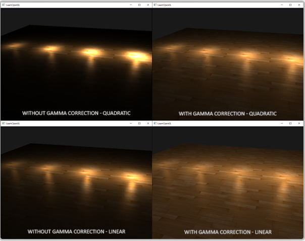
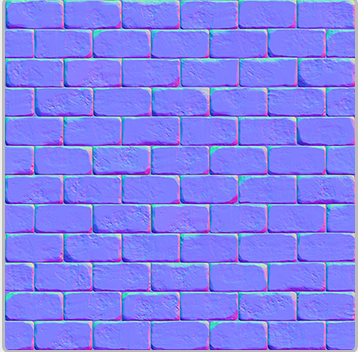
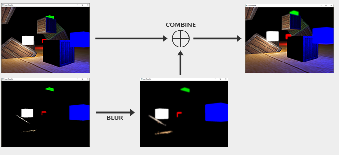
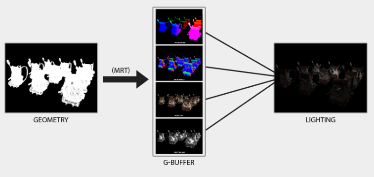

## 简介

* c++学习的地址：www.learncpp.com

## 入门

### 简介

* OpenGL仅仅只是一个规范，并不是一个API
* 渲染模式分为立即渲染模式和核心渲染模式，前者就是固定渲染管线，后者开放更多细节交给开发者使用
* OpenGL自身是一个巨大的状态机，一些列的变量描述OpenGL此时应该如何运行。这个状态通常被称为上下文，**OpenGL本身提供了一些状态设置函数以及状态使用函数，前者可以修改上下文，后者可以利用上下文进行一系列操作。**
* OpenGL中的对象大多采用结构体表示。
* 当我们需要对一个对象进行操作时，我们对需要使用的对象，使用一个id来保存它的引用。然后我们将对象绑定到上下文的目标位置，对对象结束操作之后，解绑这个对象，设置的内容还会存在于ObjectID所引用到的对象中。

#### 环境配置

为了可以再不同的电脑上开发，这边还是将windows下的环境配置文件上传了。

* 构建GLFW，[源码地址](http://www.glfw.org/download.html)，可以下载编译的库以及二进制文件
* 下载CMake，使用CMake GUI，选择源代码目录以及存放编译结果的目标文件目录，选择GLFW源码目录，然后新建一个build文件夹，选中作为目标目录。之后Configure点击一下，生成器选择是Visual Studio16的工具链。再次点击Configure，保存之后，点击Generate，生成的工程文件就会在你的build文件夹中。
* 打开build目录，打开sln工程，直接点击build solution，在build/src/Debug下就有glfw3.lib。
* 创建工程后选择x64平台，在属性的VC++的目录下添加include目录以及lib目录。
* 除此之外，在链接器部分的Input部分，在Additional Dependencies添加glfw3.lib，除此之外，还需要添加opengl32.lib。
* 配置[GLAD](https://glad.dav1d.de/), 选择语言为c/c++，选择3.3的opengl版本，profile设置core，选中Generate a loader，点击生成即可。GLAD会返回两个include文件夹和一个glad.c，需要将glad.c添加到你的工程中。

添加指令

```cpp
#inlcude <glad/glad.h>
```

### 创建窗口

* 刚开始初始化glfw

* 之后设置好glfw的版本号码（自己在这里用的是3.3）

* 然后设置opengl的渲染模式，core_profile

* 创建窗口，并且将当前window的context设置成本线程的context.

* 然后去gladLoadGLLoader加载函数的实际地址

* 之后就是调整视口，窗口调整回调以及renderLoop的逻辑

具体可以看代码中的内容。

### 绘制三角形

三个名词:

* Vertex Array Object, VAO

* Vertex Buffer Object, VBO

* Element Buffer Object, EBO或者称为Index Buffer Object, IBO

#### 可配置阶段

顶点着色器，集合着色器和片段着色器

#### 顶点输入

绘制图形之前，我们需要先给OpenGL输入一些顶点数据，openGL的NDC只处理在[-1.0 ， 1.0]之间的数据（一般来说，vertex shader会将之前的空间坐标系转换至NDC中），之后再做一次视口变换即可。

* 我们通过VBO来管理这个内存，他会在GPU显存中存储大量顶点，使用VBO的好处是我们可以一次性发送大批数据到显卡上，而不是每个顶点发送一次。

#### 创建着色器

* 使用glCreateShader(\<SHADER_TYPE\>)来创建shader

* 使用`glShadaerSource`来替换shader中的代码

* `glCompileShader`用于编译shader。

#### 链接着色器

* 说是链接，其实是单独的顶点着色器与片段着色器需要一个shaderprogram才可以使用。

下面的例子自行体会

```cpp
unsigned int shaderProgram;
shaderProgram = glCreateProgram();

glAttachShader(shaderProgram, vertexShader);
glAttachShader(shaderProgram, fragmentShader);
glLinkProgram(shaderProgram);
// 激活该程序对象
glUseProgram(ShaderProgram);
```

#### 链接顶点属性

需要指定OpenGL如何理解顶点数据。

* 使用`glVertexAttribPointer`指定顶点数组的一系列属性

* 完成之后，需要使用glEnableVertexAttribArray来指定

* The zeroing behavior does not match x86 (i.e. this instruction zeroes when an index is out-of-range instead of when the most significant bit is 1); use a constant swizzle amount (or i8x16.shuffle) to avoid 3 extra x86 instructions in some runtimes.

## 高级OpenGL篇

这边插一句，因为中间的笔记都写在纸质部分，因此这里直接从高级数据部分开始，但是中间缺失的笔记部分也会从纸质转到电子文档。

### 高级数据

* OpenGL中的数据无外乎是一个管理特定内的对象，将其绑定到一个Buffer Target上时才为其赋予了意义。例如，绑定缓冲到GL_ARRAY_BUFFER，他就表示一个顶点数组缓冲，绑定的target不同，处理的方式也不一样。
* 目前为止，我们填充Vertex buffer object的方式还是glBufferData来进行填充，如果将data参数设置为空，这相当于预留一定大小的内存，但是之后才去填充的情况时非常有用。
* glBufferSubData，与前者不同的是它还需要一个偏移量来表示从哪里开始填充数据。

```cpp
glBufferSubData(GL_ARRAY_BUFFER, 24, sizeof(data), &data);
```

* 讲数据导入缓冲的另一种方式是请求缓冲内存的指针。直接将数据复制到缓冲当中。使用glMapBuffer函数。

```cpp
float data[] = {
    0.5f, 1.0f, -0.35f
    ...
};
glBindBuffer(GL_ARRAY_BUFFER, buffer);
// 获取指针
void *ptr = glMapBuffer(GL_ARRAY_BUFFER, GL_WRITE_ONLY);

memcpy(ptr, data, sizeof(data));
glUnmapBuffer(GL_ARRAY_BUFFER);
```

#### 分批顶点属性

我们之前的顶点数据分布方式是每个顶点的位置，法向量，纹理坐标等排列在一起，但是有的时候这些数据是一个个大大的区块单独存储的，这是后就体现出glBufferSubData的好处，配合新的glVertexAttribPointer的理解顶点数据的方式就可以处理这种数据排布。

```cpp
float positions[] = { ... };
float normals[] = { ... };
float tex[] = { ... };
// 填充缓冲
glBufferSubData(GL_ARRAY_BUFFER, 0, sizeof(positions), &positions);
glBufferSubData(GL_ARRAY_BUFFER, sizeof(positions), sizeof(normals), &normals);
glBufferSubData(GL_ARRAY_BUFFER, sizeof(positions) + sizeof(normals), sizeof(tex), &tex);

// 新的数据处理方式
glVertexAttribPointer(0, 3, GL_FLOAT, GL_FALSE, 3 * sizeof(float), 0);  
glVertexAttribPointer(1, 3, GL_FLOAT, GL_FALSE, 3 * sizeof(float), (void*)(sizeof(positions)));  
glVertexAttribPointer(
  2, 2, GL_FLOAT, GL_FALSE, 2 * sizeof(float), (void*)(sizeof(positions) + sizeof(normals)));
```

#### 复制缓冲

* 其实就是当我们有一个缓冲之后，想要将当前缓冲的数据分享到另外一个缓冲。

```cpp
void glCopyBufferSubData(GLenum readtarget, GLenum writetarget, GLintptr readoffset, GLintptr writeoffset, GLsizeiptr size);
```

但如果我们想读写数据的两个不同缓冲都为顶点数组缓冲该怎么办呢？我们不能同时将两个缓冲绑定到同一个缓冲目标上。正是出于这个原因，OpenGL提供给我们另外两个缓冲目标，叫做GL_COPY_READ_BUFFER和GL_COPY_WRITE_BUFFER。我们接下来就可以将需要的缓冲绑定到这两个缓冲目标上，并将这两个目标作为`readtarget`和`writetarget`参数。

```cpp
float vertexData[] = { ... };
glBindBuffer(GL_COPY_READ_BUFFER, vbo1);
glBindBuffer(GL_COPY_WRITE_BUFFER, vbo2);
glCopyBufferSubData(GL_COPY_READ_BUFFER, GL_COPY_WRITE_BUFFER, 0, 0, sizeof(vertexData));
```

或者是单独使用GL_COPY_WRITE_BUFFER, 源target类型还是GL_ARRAY_BUFFER。

```cpp
float vertexData[] = { ... };
glBindBuffer(GL_ARRAY_BUFFER, vbo1);
glBindBuffer(GL_COPY_WRITE_BUFFER, vbo2);
glCopyBufferSubData(GL_ARRAY_BUFFER, GL_COPY_WRITE_BUFFER, 0, 0, sizeof(vertexData));
```

### 高级GLSL

#### GLSL的内建变量

* 除了我们已经知道的顶点属性，uniform变量之外，GLSL还定义了几个以```gl_```为前缀的变量
* 查看所有内置变量[OpenGl wiki](https://www.khronos.org/opengl/wiki/Built-in_Variable_(GLSL))

##### gl_PointSize

* 当渲染图元是point时生效，调整绘制点的大小。
* 同时，我们也可以通过```glPointSize```来调整渲染出来的点的大小
* 默认情况下，在顶点着色器中修改点的大小这个功能是禁用的，需要开启

```cpp
glEnable(GL_PROGRAM_POINT_SIZE);
```

* 一个典型的应用就是将点的大小设置为裁剪空间的z值，可以产生近小远大的效果

```glsl
void main()
{
    gl_Position = projection * view * model * vec4(aPos, 1.0);
    gl_PointSize = gl_Position.z;
}
```

画点这种有利于在粒子生成之类的技术中很有意思。

##### gl_VertexID

这是一个输入变量，我们只能对他进行读取，`gl_VertexID`储存了正在绘制顶点的当前ID，glDrawElements进行渲染的时候，这个变量会存储正在绘制顶点的当前索引。当使用glDrawArrays进行绘制时，表示从渲染调用开始的已处理顶点数。

#### 片段着色器变量

##### gl_FragCoord

表示片段的窗口坐标（原点为窗口的左下角），例如800 x 600，横坐标与纵坐标的范围分别就是0~800和0~600了。

* gl_FragCoord的常见应用是根据窗口坐标进行不同的输出，例如根据左右进行不同风格的输出。

```glsl
void main()
{             
    if(gl_FragCoord.x < 400)
        FragColor = vec4(1.0, 0.0, 0.0, 1.0);
    else
        FragColor = vec4(0.0, 1.0, 0.0, 1.0);        
}
```

##### gl_FrontFacing

片段着色器另外一个很有意思的输入变量是`gl_FrontFacing`， 如果不开启面剔除，那么我们可以获得当前渲染片段是正面还是背面的信息，举例来说，我们可以根据正反面计算出不同的颜色。

gl_FrontFacing是一个bool，是正面则是true，否则为False

```glsl
#version 330 core
out vec4 FragColor;

in vec2 TexCoords;

uniform sampler2D frontTexture;
uniform sampler2D backTexture;

void main()
{             
    if(gl_FrontFacing)
        FragColor = texture(frontTexture, TexCoords);
    else
        FragColor = texture(backTexture, TexCoords);
}
```

##### gl_FragDepth

可以允许我们写入深度值，但是这样会禁用提前深度测试。它被禁用的原因是，OpenGL无法在片段着色器运行**之前**得知片段将拥有的深度值，因为片段着色器可能会完全修改这个深度值。

* 它被禁用的原因是，OpenGL无法在片段着色器运行**之前**得知片段将拥有的深度值，因为片段着色器可能会完全修改这个深度值。

`condition`可以为下面的值：

| 条件        | 描述                                                         |
| :---------- | :----------------------------------------------------------- |
| `any`       | 默认值。提前深度测试是禁用的，你会损失很多性能               |
| `greater`   | 你只能让深度值比`gl_FragCoord.z`更大                         |
| `less`      | 你只能让深度值比`gl_FragCoord.z`更小                         |
| `unchanged` | 如果你要写入`gl_FragDepth`，你将只能写入`gl_FragCoord.z`的值 |

通过将深度条件设置为`greater`或者`less`，OpenGL就能假设你只会写入比当前片段深度值更大或者更小的值了。这样子的话，当深度值比片段的深度值要小的时候，OpenGL仍是能够进行提前深度测试的。

```glsl
#version 420 core // 注意GLSL的版本！
out vec4 FragColor;
layout (depth_greater) out float gl_FragDepth;

void main()
{             
    FragColor = vec4(1.0);
    gl_FragDepth = gl_FragCoord.z + 0.1;
}  
```

#### 接口块（Interface blocks）

当程序变大时，从顶点着色器像片段着色器发送数据不能单单一个个变量这么去定义了。

这样就可以利用结构体这样的结构，我们需要在结构体之前额外添加in或者out关键字，并且记得结构体类型名应该一致，但是名称可以不一样。

例子如下：

```glsl
#version 330 core
layout (location = 0) in vec3 aPos;
layout (location = 1) in vec2 aTexCoords;

uniform mat4 model;
uniform mat4 view;
uniform mat4 projection;

out VS_OUT
{
    vec2 TexCoords;
} vs_out;

void main()
{
    gl_Position = projection * view * model * vec4(aPos, 1.0);    
    vs_out.TexCoords = aTexCoords;
}  
```

片段着色器

```glsl
#version 330 core
out vec4 FragColor;

in VS_OUT
{
    vec2 TexCoords;
} fs_in;

uniform sampler2D texture;

void main()
{             
    FragColor = texture(texture, fs_in.TexCoords);   
}
```

#### Uniform缓冲对象

* OpenGL为我们提供了一个叫做Uniform缓冲对象(Uniform Buffer Object)的工具，它允许我们定义一系列在多个着色器中相同的**全局**Uniform变量。

* 因为Uniform缓冲对象仍是一个缓冲，我们可以使用glGenBuffers来创建它，将它绑定到GL_UNIFORM_BUFFER缓冲目标，并将所有相关的uniform数据存入缓冲。

For example:
```glsl
#version 330 core
layout (location = 0) in vec3 aPos;

layout (std140) uniform Matrices
{
    mat4 projection;
    mat4 view;
};

uniform mat4 model;

void main()
{
    gl_Position = projection * view * model * vec4(aPos, 1.0);
}  
```

其中，访问projection和view不需要添加前缀。

layout（std140）表示特定的uniform block layout(Uniform块布局)

##### Uniform block layout

Uniform block实际上还是储存在一个缓冲对象中的，实际上它只是一个预留内存，我们还需要告诉OpenGL内存的那一部分对应着色器中的哪一个uniform变量。

```glsl
layout (std140) uniform ExampleBlock
{
    float value;
    vec3  vector;
    mat4  matrix;
    float values[3];
    bool  boolean;
    int   integer;
};
```

在使用这些uniform变量之前我们需要每个变量的大小和偏移量，让我们能够把它放到buffer中。

默认情况下，GLSL会使用一个叫做共享（Shared）布局的Uniform内存布局，GLSL可以为了优化二队uniform变量的位置进行变动。所以我们需要使用`glGetUniformIndices`这样的函数来查询这个信息，

```c
void glGetUniformIndices(	GLuint program,
 	GLsizei uniformCount,
 	const GLchar **uniformNames,
 	GLuint *uniformIndices);
```

参数解释：

- **`program`**

  Specifies the name of a program containing uniforms whose indices to query.

- **`uniformCount`**

  Specifies the number of uniforms whose indices to query.

- **`uniformNames`**

  Specifies the address of an array of pointers to buffers containing the names of the queried uniforms.

- **`uniformIndices`**

  Specifies the address of an array that will receive the indices of the uniforms.

需要注意的是，我们可以一次性查询多个uniformNames，函数也会一次性写入多个indices(我在这里理解的就是偏移量)

如果希望我们可以手动推算每个uniform变量的偏移量，我们可以使用std140布局。

每个类型的变量都有一个base alignment，他表示一个遍阿玲Unifrom块中所占据的空间（包括padding）,另外一个概念叫做对齐偏移量(Aligned Offset）,他表示从block起始位置开始到这个变量的字节偏移量。**其中，对齐字节偏移量必须是基准对齐数量的倍数**，这点很好理解，和传统c++的内存对齐是差不多的概念。

| 类型                | 布局规则                                                     |
| :------------------ | :----------------------------------------------------------- |
| 标量，比如int和bool | 每个标量的基准对齐量为N。                                    |
| 向量                | 2N或者4N。这意味着vec3的基准对齐量为4N。                     |
| 标量或向量的数组    | 每个元素的基准对齐量与vec4的相同。                           |
| 矩阵                | 储存为列向量的数组，每个向量的基准对齐量与vec4的相同。       |
| 结构体              | 等于所有元素根据规则计算后的大小，但会填充到vec4大小的倍数。 |

完整的计算规则，可以再[OpenGL wiki](https://registry.khronos.org/OpenGL/extensions/ARB/ARB_uniform_buffer_object.txt)中找到

使用该计算规则，计算之前的成员的例子：

```glsl
layout (std140) uniform ExampleBlock
{
                     // 基准对齐量       // 对齐偏移量
    float value;     // 4               // 0 
    vec3 vector;     // 16              // 16  (必须是16的倍数，所以 4->16)
    mat4 matrix;     // 16              // 32  (列 0)
                     // 16              // 48  (列 1)
                     // 16              // 64  (列 2)
                     // 16              // 80  (列 3)
    float values[3]; // 16              // 96  (values[0])
                     // 16              // 112 (values[1])
                     // 16              // 128 (values[2])
    bool boolean;    // 4               // 144
    int integer;     // 4               // 148
}; 
```

* 剩下的一个布局是`packed`。当使用紧凑(Packed)布局时，是不能保证这个布局在每个程序中保持不变的（即非共享），因为它允许编译器去将uniform变量从Uniform块中优化掉，这在每个着色器中都可能是不同的。

##### 使用Uniform缓冲

这里其实熟悉两个概念就好了，在shader内部定义的叫uniform block，在程序中定义的叫uniform buffer。想让uniform buffer的数据传输到uniform block上时，我们需要引入绑定点这些概念，一个uniform block一个绑定点，一个uniform buffer可以绑定到多个绑定点上（借助glBindBufferRange来实现）。


* **将uniform block绑定到Binding points上的方法**

  * 首先，从shaderProgram中查询到这个unifromBlock的索引（index）,之后使用glUniformBlockBinding，它接收shaderProgramID, 索引index以及绑定点的值。例子如下：

  ```c++
  unsigned int lights_index = glGetUniformBlockIndex(shaderA.ID, "Lights");   
  glUniformBlockBinding(shaderA.ID, lights_index, 2);
  ```

  * 注意以上步骤需要对每个定义了相同名字的uniform block需要设置一遍（获取对应block index，然后在c++层绑定到相应的binding point）
  * 从OpenGL4.2开始，我们也可以在uniform block声明的时候推按加一个布局标识符，显示的将Unifrom块的绑定点存储在着色器中，例子如下：

  ```glsl
  layout(std140, binding = 2) uniform Lights { ... };
  ```

* **将Uniform buffer 绑定到相同绑定点上的方法**

  * 主要有两种方法，第一种是glBindBufferBase，第二种是glBindBufferRange

  ```c++
  glBindBufferBase(GL_UNIFORM_BUFFER, 2, uboExampleBlock); 
  // 或
  glBindBufferRange(GL_UNIFORM_BUFFER, 2, uboExampleBlock, 0, 152); // 这种方法具有一定的限制，offset据说必须是GL_UNIFORM_BUFFER_OFFSET_ALIGHMENT的倍数
  ```

  可以看到第一种方法直接将uniform buffer绑定到了一个binding point，而第二种方法可以将Uniform buffer的一部分绑定到一个binding point上。通过这种方式，我们可以让不同的Uniform block对应到一个uniform buffer object上。

* **双方Bind结束之后，如何向buffer中添加数据**

  * 使用glBufferSubData

  ```cpp
  glBindBuffer(GL_UNIFORM_BUFFER, uboExampleBlock);
  int b = true; // GLSL中的bool是4字节的，所以我们将它存为一个integer
  glBufferSubData(GL_UNIFORM_BUFFER, 144, 4, &b); 
  glBindBuffer(GL_UNIFORM_BUFFER, 0);
  ```

  需要注意的还是偏移量和数据长度，这一点在布局中已经有介绍了。

#### Summary

* 自己实现的过程中，因为使用的是cubemap的场景，所以view mat也不能放一起，只有projection mat是共用的

使用uniform block的好处

* 一次设置很多uniform会比一个一个设置多个uniform要快很多。
* 比起在多个着色器中修改同样的uniform，在Uniform缓冲中修改一次会更容易一些。
* 如果使用Uniform缓冲对象的话，你可以在着色器中使用更多的uniform。OpenGL限制了它能够处理的uniform数量，这可以通过GL_MAX_VERTEX_UNIFORM_COMPONENTS来查询(```glGetIntegerv(GL_MAX_VERTEX_UNIFORM_COMPONENTS, &max_vertex_uniform_cnt);```，这个值跑出来是4096)。当使用Uniform缓冲对象时，最大的数量会更高。所以，当你达到了uniform的最大数量时（比如再做骨骼动画(Skeletal Animation)的时候），你总是可以选择使用Uniform缓冲对象。

### 几何着色器

几何着色器用于变换后者生成不同的图元。

### 实例化（Instancing）

如果大部分的木星包含的是同一组数据，只不过进行的是不同的世界空间变化，这种情况下就可以使用实例化渲染，将

```c++
// glDrawArrays => glDrawArraysInstanced
// glDrawElements => glDrawElementsInstanced
```

后者提供了一个额外的参数，实例化调用次数。

* 但是，光有实例化次数还是没有用，我们还需要向着色器提供不同的世界变换矩阵。
* 使用实例化渲染时，GLSLS在顶点着色器中内嵌的内建变量，`gl_InstanceID`, 它会从0开始，在每个实例被渲染时候加一，此时，我们的顶点着色器变为

```glsl
#version 330
layout(location = 0)in vec2 aPos;
layout(location = 1)in vec3 aColor;

out vec3 fcolor;
uniform vec2 offsets[100];

void main()
{
    vec2 offset = offsets[gl_InstanceID];
    gl_Position = vec4(aPos + offset, 0.0, 1.0);
    fcolor = aColor;
}
```

* 在正式执行这个顶点着色器之前，我们需要将uniform数据传送到顶点着色器。

#### 实例化数组

以上的这种方式有一个缺点，就是我们渲染的实例个数较大时，可能会超过uniform数据的上限，这时候我们就需要使用实例化数组，实例化数组与普通的顶点属性没有太大区别，我们只需要告诉gl每次更新对应位置顶点数据的频率即可。默认情况下是逐顶点更新数据，使用```glVertexAttribDivisor```即可改变对应顶点属性的更新频率。

```c++
unsigned int instanceVBO;
glGenBuffers(1, &instanceVBO);
glBindBuffer(GL_ARRAY_BUFFER, instanceVBO);
glBufferData(GL_ARRAY_BUFFER, sizeof(glm::vec2) * 100, &translations[0], GL_STATIC_DRAW);
glBindBuffer(GL_ARRAY_BUFFER, 0);

glEnableVertexAttribArray(2);
glBindBuffer(GL_ARRAY_BUFFER, instanceVBO);
glVertexAttribPointer(2, 2, GL_FLOAT, GL_FALSE, 2 * sizeof(float), (void*)0);
glBindBuffer(GL_ARRAY_BUFFER, 0);
glVertexAttribDivisor(2, 1);
```

可以看到最后一行，对索引值为2的顶点属性设置了更新评率，第二个参数是0时，表示每个顶点更新一次，如果是大于0的数字，则表示每隔多少个实例更新一次。这里设置为1，则说明每隔一个实例更新一次（就是每个实例都会更新一次）

### 抗锯齿

本节主要讲述了MSAA，MSAA的大致思想就是在每个像素位置做多个采样点，根据覆盖到的采样点数量以及没有覆盖到的采样点数量做插值，概念上来说较为明了，但是实践起来稍微复杂，尤其是离屏MSAA，步骤繁多。

#### 主屏幕上的MSAA

主要是在创建window部分做就ok了。

```c++
glfwWindowHint(GLFW_SAMPLES, 4);
glEnable(GL_MULTISAMPLE);
```

#### 离屏MSAA

如果希望在自己创建的Framebuffer上做MSAA，步骤还会更加复杂。

```c++
unsigned int framebuffer;
glGenFramebuffer(GL_FRAMEBUFFER, framebuffer);

unsigned int textureMulSam;
glGenTexture(1, &textureMulSam);
glBindTexture(GL_TEXTURE_2D_MULTISAMPLE, textureMulSam);
glTexImage2DMultisample(GL_TEXTURE_2D_MULTISAMPLE, 4, GL_RGB, WIDTH, HEIGHT, GL_TRUE);
glBindTexture(GL_TEXTURE_2D_MULTISAMPLE, 0);
glFramebufferTexture2D(GL_FRAMEBUFFER, GL_COLOR_ATTACHMENT0, GL_TXTURE_2D_MULTISAMPLE, textureMulSam, 0);

unsigned int rbo;
glGenRenderbuffers(1, &rbo);
glBindRenderbuffer(GL_RENDERBUFFER, rbo);
glRenderbufferStorageMultisample(GL_RENDERBUFFER, 4, GL_DEPTH24_STENCIL8, WIDTH, HEIGHT);
glBindRenderbuffer(GL_RENDERBUFFER, 0);
glFramebufferRenderbuffer(GL_FRAMEBUFFER, GL_DEPTH_STENCIL_ATTACHMENT, GL_RENDERBUFFER, rbo);

if(glCheckFramebufferStatus(GL_FRAMEBUFFER) != GL_FRAMEBUFFER_COMPLETE)
    // ERROR HANDLING

// Blit, 默认从READ_FRAMEBUFFER传送到DRAW_FRAMEBUFFER, 因此传送之前现需要绑定一下
glBindFramebuffer(GL_READ_FRAMEBUFFER, framebuffer);
glBindFramebuffer(GL_DRAW_FRAMEBUFFER, 0); // 如果是离屏后处理，那么这里的第二个参数是中介FBO

```

#### 不采用中介FBO的离屏AA

如果不使用中介FBO，而是直接传入多重采样的纹理图像，需要将采样器类型额外设置

```glsl
uniform sampler2DMS screenTextureMS;

vec4 colorSample = texelFetch(screenTextureMS, TexCoords, 3); // 从0， 1， 2， 3开始取
```

## 高级光照篇

### Blinn-Phong

相对来说，计算比较简单，就是将原来视线与反射光线的夹角点乘换为发现与视线和光线的分界线的点乘。

**但是我们需要知道这样相比原来的有点在哪，Blinn-Phong主要还是解决了，当视线与反射光线夹角超过90度的情况下，镜面光突然出现断层导致的不自然情况**


其余的没有太多好说的。

### Gamma矫正

简单来说，就是人眼感知到的亮度和物理上光的强度是不一致的，将光照强度量化在0，1区间内，人眼实际感受到的亮度是物理光的强度的2.2次幂，这个2.2常被称为Gamma系数。

**由于我们在着色器中计算光照的时候，都默认是在线性空间中做的，但是实际显示到屏幕上时可能会比我们期望的要暗一些，因此艺术家的解决方法是做漫反射贴图的时候通常会做的亮一些。而Gamma校正是为了解决这个问题，一般来说Gamma Correction会在将buffer送往显示器之前做一个1/gamma的幂指数运算，最后得到的结果在线性空间内，为什么要在线性空间内部，是因为线性空间符合物理规则，光照结果更具有真实感**

#### Gamma Correction的两种方法

* GL自己设置

```c++
glEnable(GL_FRAMEBUFFER_SRGB);
```

缺点是对所有的Framebuffer都会设置，缺少灵活性

* 自己在着色器中设置

```glsl
void main()
{
    // do super fancy lighting in linear space
    [...]
    // apply gamma correction
    float gamma = 2.2;
    FragColor.rgb = pow(fragColor.rgb, vec3(1.0/gamma));
}
```

缺点是需要在场景中的每一个shader中都设置，当然也可以使用后处理方法，将结果绘制到一个FrameBuffer上，然后再绘制到一个quad上。

#### sRGB Texture

引入这个问题的原因是，很多建模制作软件不支持线性空间，导致我们的一些纹理都是根据sRGB空间得来的，因此在我们对最招结果做了gamma校正后，相当于给colorbuffer做了两次gamma校正。

因此我们需要在导入的时候设置texture的格式，但是像specularMaps和Normal Map这种不是在sRGB空间中创造的就不需要设置。

```c++
glTexImage2D(GL_TEXTURE_2D, 0, GL_SRGB, width, height, 0, GL_RGB, GL_UNSIGNED_BYTE, data); 
```

如果带有alpha通道值，将格式改为GL_SRGB_ALPHA.

#### 光照衰减

讨论了一下没有校正时候，线性的衰减方程更有更好的效果，但是有了gamma校正还是平方衰减比较好。



### Shadow Mapping（阴影映射）

* 视口大小和shadow map的分辨率差别，不设置成1024有问题么
* 偏移可以解决普通shadow map导致的黑条问题，但是吐过出现阴影过大，则应该使用正面剔除，让正面完全暴露出来，不是一边在上一边在下，此时就不使用depth map偏移法了。
* 解决frag在视椎之外的问题，如果在四周的话，切换depth map的clamp方式为clamp to border，如果深度大于1，直接不做阴影处理（因此这种方法在远处就看不到物体的阴影了）
* shadow map分辨率有限，导致多个fragment采样到一个depth texel，因此会导致阴影边缘锯齿状。可以应用PCF进行柔和，但是放大看仍然会有不真实感。
* 关于平行光和点光源Shadow map的不同，就是点光源的projection matrix算出来的深度值是非线性的，导致深度值上升的很快，因此深度图基本都是白的。

### Point Shadows(点阴影)

* 上一小节的shadow map还有一个限制就是，它只能在光照的方向上去产生阴影，这一章的重点就是在各个方向上产生阴影。被称之为point shadows或者是omnidirectional shadow maps

* 和上一章最大的不同是我们使用的shadow map的不同，shadow map只存储了一个方向上的shadow map, 如果从各个方向去生成一个shadow Map，并且将每个方向的depth map存储到一个cube map中，这样就可以得到各个方向的深度图了。

* 剩下的难点就是如何去generate cubemap

* 如果为了生成6个depth map而去做6次render pass，这个代价有点过于昂贵，因此我们将利用geometry shader做一些trick.

* Light Space transform.

  * 首先是projection matrix，每个面都是相同的，可以用一个投影矩阵。**需要注意的是fov应该选90度，这样我们可以覆盖6个面**
  * 最终组合六个方向的lookat矩阵就可以构建出我们的ligh Space transform matrix.

* 如何使用geometry shader去构建不同的6个面

  * 利用gl_Layer往六个不同的面上去发送数据，并且对每个顶点引用相对应面的transform matrix.

  ```glsl
  #version 330 core
  layout (triangles) in;
  layout (triangle_strip, max_vertices=18) out;
  
  uniform mat4 shadowMatrices[6];
  
  out vec4 FragPos; // FragPos from GS (output per emitvertex)
  
  void main()
  {
      for(int face = 0; face < 6; ++face)
      {
          gl_Layer = face; // built-in variable that specifies to which face we render.
          for(int i = 0; i < 3; ++i) // for each triangle vertex
          {
              FragPos = gl_in[i].gl_Position;
              gl_Position = shadowMatrices[face] * FragPos;
              EmitVertex();
          }    
          EndPrimitive();
      }
  } 
  ```

* 计算线性的深度值

由于点光源的投影矩阵计算出来得到的深度值是非线性映射的，因此我们需要在片段着色器中重新计算深度值，然后覆写gl_FragDepth这个变量。

```glsl
#version 330 core
in vec4 FragPos;

uniform vec3 lightPos;
uniform float far_plane;

void main()
{
    // get distance between fragment and light source
    float lightDistance = length(FragPos.xyz - lightPos);
    
    // map to [0;1] range by dividing by far_plane
    lightDistance = lightDistance / far_plane;
    
    // write this as modified depth
    gl_FragDepth = lightDistance;
} 
```

### Normal Mapping

* 在冯乐乐的那本书里面其实有提到过了，就是用一张贴图记录法线信息，不至于说一个三角形面一个法向量。
* 法线贴图一般都是以蓝色为基础，因为大部分的法线都会在（0， 0， 1）附近，指向正z轴，然后每个砖块的缝隙上部，法线会往y轴上面走，所以会呈现一种偏绿色的感觉。



* 注意法线向量的分量范围在-1到1之间，但是颜色分量的范围在0到1之间，因此我们将法线贴图采样出来的值，还要做*2 -1的操作。

```glsl
uniform sampler2D normalMap;  

void main()
{           
    // obtain normal from normal map in range [0,1]
    normal = texture(normalMap, fs_in.TexCoords).rgb;
    // transform normal vector to range [-1,1]
    normal = normalize(normal * 2.0 - 1.0);   
  
    [...]
    // proceed with lighting as normal
}  
```

#### Normal map的方向限制

因为Normal Map的方向大多都指向z轴正方向，但是如果mesh换了方向，那么还在世界坐标中计算光照的话就不对了，因此，我们需要在一个法向量都大致指向z轴正方向的坐标系中去做光照计算，这就是切线空间。

* 切线空间又称作TBN空间，Tagent, Bitangent and Normal
* 文中提到的计算切线和副切线的方法感觉有些繁琐，可以去看看冯乐乐那本书上的内容（教程中介绍的方法是用uv坐标和三角形坐标去做计算）
* 计算好TBN矩阵之后，我们有两种方式去使用这个矩阵：
  * 第一种方法是将矩阵传到fragment shader，将法线从切线空间转为世界空间，再做运算
  * 第二种方法是将TBN矩阵的逆矩阵传到fragment shader，将除了切线以外的所有光照变量转到切线空间，然后做最终的光照运算。
* 教程虚晃一枪，到最后得出的最优结论是在顶点着色器中计算viewPos和lightPos到切线空间，并且将FragPos也切换到切线空间，这样做的原因是顶点着色器的执行次数相对来说会更少。

#### 复杂模型

在教程中我们是自己算的TBN矩阵，但一般在模型加载的过程中，我们就会算好TBN矩阵，在Assimp导入文件的时候设置````aiProcess_CalcTangentSpace```，Assimp会自动计算TBN矩阵。

* 使用Normal map还有一个好处就是我们可以使用相对较少的数量的三角形来达到比较精细的结果。

#### 格拉姆-施密特正交化

就是大型模型再算切线的时候会做平均化，但是这样得出的TBN矩阵不会是正交矩阵，因此我们需要做这样一个操作使得操作过后得到的矩阵重新正交（这里直接放代码，实际原理也很好理解）

```glsl
vec3 T = normalize(vec3(model * vec4(aTangent, 0.0)));
vec3 N = normalize(vec3(model * vec4(aNormal, 0.0)));
// re-orthogonalize T with respect to N
T = normalize(T - dot(T, N) * N);
// then retrieve perpendicular vector B with the cross product of T and N
vec3 B = cross(N, T);

mat3 TBN = mat3(T, B, N)  
```

假设T, N不垂直，那么就从T往N上投影，用T减去这个投影长度向量，然后重新算出来一个真正的和N垂直的T，再利用N， T叉乘得到副切线。

### 视差贴图

和法线贴图类似，也是一种给mesh表面真实感的技术手段，在介绍完法线空间之后更适合来介绍视差贴图。

* 视差贴图其实就是在texture中去存储高度信息，在每个texel中存储不同的高度值。
* 普通情况下，让顶点做位移，以达到高度不同的效果，需要很多顶点数据，但是使用了视差贴图之后，我们只需要很少的顶点数据就能让场景看上去具有很多的深度信息。

### HDR

* 通常情况下，我们计算出来的亮度值和颜色值都在0到1之间，如果场景中的光源是这些颜色的数值超过1，这些值也会被clamp到1，这样导致场景看上去效果不是那么好（因为很多片段都是1的颜色值，导致图片中一大块区域都是亮的）
* 如果允许颜色超过1，那么我们就在一个high dynamic range中进行渲染工作，这就叫做HDR
* 将颜色渲染到HDR范围，然后再压缩到0到1之间被称作tone mapping.
* tone mapping非常重要的一点就是将HDR色域转换到LDR色域时候，保留更多的细节。
* HDR还有一个好处就是它解放了光照系数的范围，之前可能多亮的光强都会被clamp到0，1之间，但是现在我们可以对强度差异很大的光源设置成差异特别大的值，例如太阳的光照强度设置成100.

#### Floating point framebuffer

* 将Framebuffer的格式设置为GL_RGB时，OpenGL会自动将这些值clamp到0，1之间再存储到Framebuffer之中，如果我们将Framebuffer的格式设置为GL_RGB16F, GL_RGBA16F， GL_RGB32F, GL_RGBA32F时，framebuffer就可以存储在0到1之外的浮点值。
* 如果需要改变framebuffer的格式，我们只需要改变绑定的color buffer的格式

```c++
glBindTexture(Gl_TEXTURE_2D, colorBuffer);
glTexImage2D(GL_TEXTURE_2D, 0, GL_RGBA16F, WIDTH, HEIGHT, 0, GL_RGBA, GL_FLOAT, NULL);
```

* 所以大致的渲染流程是将正常的渲染到一个attach了float point的framebuffer上，然后再利用这个framebuffer作一个texture，渲染到一个quad上。
* 但是由于float point framebuffer中存储的值不在0，1之间，因此超出这个范围的值直接被采样然后输出到framebuffer 0的话，就会被clamp到1，导致丢失了很多光照细节，因此引入了我们所需要的Tone mapping算法。

#### Tone mapping

  教程中介绍的Tone mapping是Reinhard tone mapping(莱茵哈特算法？大锤还会干这个？)

```glsl
void main()
{             
    const float gamma = 2.2;
    vec3 hdrColor = texture(hdrBuffer, TexCoords).rgb;
  
    // reinhard tone mapping
    vec3 mapped = hdrColor / (hdrColor + vec3(1.0));
    // gamma correction 
    mapped = pow(mapped, vec3(1.0 / gamma));
  
    FragColor = vec4(mapped, 1.0);
}
```

可以看到，这个所谓的tone mapping算法，就是在分母加了一个全1变量，非常简单的处理。

此外，还有一种利用曝光参数的tone mapping调试方法（就比如说做一个长曝光，白天光线好的时候曝光系数要小点，晚上光线较暗时，需要我们将曝光系数调高一点），同理，我们可以根据光源的实际情况来调整曝光参数的大小。

```glsl
uniform float exposure;

void main()
{             
    const float gamma = 2.2;
    vec3 hdrColor = texture(hdrBuffer, TexCoords).rgb;
  
    // exposure tone mapping
    vec3 mapped = vec3(1.0) - exp(-hdrColor * exposure);
    // gamma correction 
    mapped = pow(mapped, vec3(1.0 / gamma));
  
    FragColor = vec4(mapped, 1.0);
}
```

我们可以看到如果曝光系数大，我们得场景就会更亮一些，反之则更暗一些，因此可以调整曝光系数来选看清明亮处还是暗处的细节。

### Bloom

bloom的意思是盛开，开放，在图形学中的实际含义其实是在光源终边添加光晕，在光源旁边好像溢出的感觉一样。这样做可以极大地提升光源的视觉效果。

* Bloom比较适合和HDR结合在一起去实现，我们拿到HDR buffer之后。首先Extract图像中较为亮的区域，fragment的亮度超过一定阈值才保留，否则则转变为黑色。之后对这些图像中较为明亮的区域做一些filter，之后再将这些做了模糊处理的图像和原来的HDR图像结合在一起。



* 泛光的重点在于将明亮区域模糊化处理的模糊算法。

#### 提取图像中明亮的部分

我们可以使用MRT技术，即Multiple Render Target技术来在一次Render pass中渲染出两张图像。 实际上是在一个fragment shader中指定多个输出。

```glsl
layout (location = 0) out vec4 FragColor;
layout (location = 1) out vec4 BrightColor;  
```

**之前在framebuffer那一章节，我们在添加Texture到Framebuffer上时用的GL_COLOR_ATTACHMENT0选项，之后其实还有GL_COLOR_ATTACHMENT1等等**， 代表了我们可以给Framebuffer附着的多个color buffer，由此对应fragment的MRT。

* 在通过glDrawBuffers指定我们需要绘制的两个buffer，否则默认情况下，只会绘制第一个color buffer。

```c++
unsigned int attachments[2] = { GL_COLOR_ATTACHMENT0, GL_COLOR_ATTACHMENT1 };
glDrawBuffers(2, attachments);  
```

* 如此设置之后，就可以在frag shader中去output两个输出。

```glsl
#version 330 core
layout (location = 0) out vec4 FragColor;
layout (location = 1) out vec4 BrightColor;

[...]

void main()
{            
    [...] // first do normal lighting calculations and output results
    FragColor = vec4(lighting, 1.0);
    // check whether fragment output is higher than threshold, if so output as brightness color
    float brightness = dot(FragColor.rgb, vec3(0.2126, 0.7152, 0.0722));
    if(brightness > 1.0)
        BrightColor = vec4(FragColor.rgb, 1.0);
    else
        BrightColor = vec4(0.0, 0.0, 0.0, 1.0);
}
```

我们可以直接对得到的第二个输出纹理做box filter，但是教程里提到另外一种filter方式，那就是高斯模糊。

#### Gaussian blur

就是正态分布，最重要的是我们可以通过在两个方向上做卷积的方式来达到在一个方形内部做卷积的结果，这个方法叫两步高斯模糊。

我们设置每个偏移对应的概率，然后创建两个fbo，分别进行水平和竖直方向的模糊。

（**实践看上去还比较复杂，之后把概念快速过一遍还要回来敲一下代码练下手**）

### Deffered Shading

我们首先需要明白Deffered Shading适用的场景，场景中物体特别多，光源也比较多的时候，比较适合Deffered Shading，传统的forward rendering是逐object进行顶点和片段着色，但是光源和物体比较多的时候，很多着色计算部分都是多余的（因为物体太多会造成很多遮挡关系）

* 解决方法，两次render pass，一次渲染出geometry buffer（这个就是所谓的G-buffer），包括了position，normal，albedo,  specular等信息。第二次render pass利用G-buffer中的信息做光照计算。**需要注意的是在第二次render pass中我们是逐fragment去做计算的，而非逐object去看，因此会节省大量的计算**
* 下图阐述了deferred shading的过程：



因为G-buffer中存储的片段一定是最后通过深度测试显示在屏幕上的片段，因此我们只需要对每个片段做一次光照计算

* 缺点，除了需要存储额外几个color buffer之外，deferred shading 还不适用于需要进行透明度混合的情况，并且deferred shading不太适合MSAA，一个是由于历史缘故（早期的图形硬件API不支持MRT和MSAA同时开启），另外就是由于第一次render pass有多个render target，因此需要对每个RT做super sampling对于显存来说是一个极大的浪费。 所一般来说Deferred shading做AA使用FXAA。

#### The G-buffer

G-buffer实际上是我们计算光照所用到的数据的集合：

* fragment的世界坐标系位置
* diffuse color也被叫做albedo系数
* 片元的法线数据
* 镜面光强度数据，应该就是指做指数运算的那个指数
*  各种光源的数据，位置，光的颜色等
* 摄像机（或者说观测者）的位置

最下面两项可以使用uniform来直接进行传递。

借用教程中的伪代码来阐述渲染流程：

```c++
while(...) // render loop
{
    // 1. geometry pass: render all geometric/color data to g-buffer 
    glBindFramebuffer(GL_FRAMEBUFFER, gBuffer);
    glClearColor(0.0, 0.0, 0.0, 1.0); // keep it black so it doesn't leak into g-buffer
    glClear(GL_COLOR_BUFFER_BIT | GL_DEPTH_BUFFER_BIT);
    gBufferShader.use();
    for(Object obj : Objects)
    {
        ConfigureShaderTransformsAndUniforms();
        obj.Draw();
    }  
    // 2. lighting pass: use g-buffer to calculate the scene's lighting
    glBindFramebuffer(GL_FRAMEBUFFER, 0);
    lightingPassShader.use();
    BindAllGBufferTextures();
    SetLightingUniforms();
    RenderQuad();
}
```

之后的工作就是创建gBuffer，然后attach四个colorattachment上去，对于精度要求比较高的位置和法线，我们使用GL_RGBA16F的格式，对于精度比较低的albedo和specular texture，我们只需要使用普通的每位置8bit精度即可。另外注要使用RGBA格式的原因是数据对对齐。如果不使用RGBA格式，有的GPU上可能会出问题。

```c++
unsigned int gBuffer;
glGenFramebuffers(1, &gBuffer);
glBindFramebuffer(GL_FRAMEBUFFER, gBuffer);
unsigned int gPosition, gNormal, gColorSpec;

// - position color buffer
glGenTextures(1, &gPosition);
glBindTexture(GL_TEXTURE_2D, gPosition);
glTexImage2D(GL_TEXTURE_2D, 0, GL_RGBA16F, WIDTH, HEIGHT, 0, GL_RGBA, GL_FLOAT, NULL);
glTexParameteri(GL_TEXTURE_2D, GL_TEXTURE_MIN_FILTER, GL_NEAREST);
glTexParameteri(GL_TEXTURE_2D, GL_TEXTURE_MAG_FILTER, GL_NEAREST);
glFramebufferTexture2D(GL_FRAMEBUFFER, GL_COLOR_ATTACHMENT0, GL_TEXTURE_2D, gPosition, 0);

// - normal color buffer
glGenTextures(1, &gNormal);
glBindTexture(GL_TEXTURE_2D, gNormal);
glTexImage2D(GL_TEXTURE_2D, 0, GL_RGBA16F, WIDTH, HEIGHT, 0, GL_RGBA, GL_FLOAT, NULL);
glTexParameteri(GL_TEXTURE_2D, GL_TEXTURE_MIN_FILTER, GL_NEAREST);
glTexParamteri(GL_TEXTURE_2D, GL_TEXTURE_MAG_FILTER, GL_NEAREST);
glFramebufferTexture2D(GL_FRAMEBUFFER, GL_COLOR_ATTACHMENT1, GL_TEXTURE_2D, gNormal, 0);

// color + specular buffer
glGenTextures(1, &gColorSpec);
glBindTexture(GL_TEXTURE_2D, gColorSpec);
glTexImage2D(GL_TEXTURE_2D, 0, GL_RGBA, WIDTH, HEIGHT, 0, GL_RGBA, GL_UNSIGNED_BYTE, 0);
glTexParameteri(GL_TEXTURE_2D, GL_TEXTURE_MIN_FILTER, GL_NEAREST);
glTexParameteri(GL_TEXTURE_2D, GL_TEXTURE_MAG_FILTER, GL_NEAREST);
glFramebufferTexture2D(GL_FRAMEBUFFER, GL_COLORATTACHMENT2, GL_TEXTURE_2D, gColorSpec, 0);

unsigned int attachments[] = {GL_COLOR_ATTACHMENT0, GL_COLOR_ATTACHMENT1, GL_COLOR_ATTACHMENT2};

glDrawBuffers(3, attachments);
```

然后使用对应的三输出fragment shader，输出到三个texture中。

```glsl
#version 330 core
layout (location = 0) out vec3 gPosition;
layout (location = 1) out vec3 gNormal;
layout (location = 2) out vec4 gAlbedoSpec;

in vec2 TexCoords;
in vec3 FragPos;
in vec3 Normal;

uniform sampler2D texture_diffuse1;
uniform sampler2D texture_specular1;

void main()
{    
    // store the fragment position vector in the first gbuffer texture
    gPosition = FragPos;
    // also store the per-fragment normals into the gbuffer
    gNormal = normalize(Normal);
    // and the diffuse per-fragment color
    gAlbedoSpec.rgb = texture(texture_diffuse1, TexCoords).rgb;
    // store specular intensity in gAlbedoSpec's alpha component
    gAlbedoSpec.a = texture(texture_specular1, TexCoords).r;
}
```

请注意在这个fragment shader中我们存储的数值都是在世界坐标系中的。

#### The deferred lighting pass

获取这位置，法线，以及漫反射和反射，都从texture中采样得到。

#### 结合deferred shading和forward shading

重点在于获取之前渲染gbuffer的深度信息，只需要glBlitFramebuffer这个函数即可。

#### 如何处理大量光源

光体积（light Volumes），目前来看就是计算光源的时候，每个光源有一定的照亮范围，然后我们对每个片元进行计算的时候进行剪枝（照不到的）。这个可照明半径就是光体积。

* 需要注意的是，光照的衰减方程，

[deferred shading and light volumes](https://www.reddit.com/r/opengl/comments/72ez7b/deferred_rendering_light_volumes_is_this_approach/)

### PBR

* glfwMakeContextConcurrent: 可以简单理解为每一个window对应一个state，对应的gl指令都是针对这个状态机的
